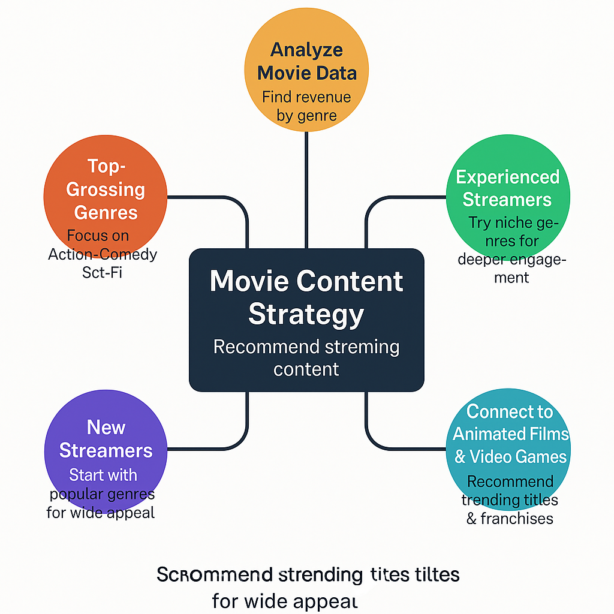

# 🎬 Data-Driven Movie Content Strategy for Streamers

## 📊 Key Findings from Movie Dataset

### 1. Top-Grossing Genres (by Revenue):
- **Action**: $9.9B total revenue
- **Comedy**: $3.9B
- **Drama**: $2.3B
- **Sci-Fi** and **Adventure**: ~$1.8B each

### 2. Most Frequently Released Genres (2012–2016):
- Dominated by **Comedy** and **Action**
- Consistent output in **Drama**, **Thriller**
- **Niche genres**: Musical, Religious, Documentary (less frequent)

### 3. Top 10 Blockbusters (by Revenue):
- Primarily **Action** with franchise strength
- Examples: *The Hobbit*, *Batman v Superman*, *The Amazing Spider-Man*, *Men in Black 3*

---

## 🎥 Content Strategy for Streamers

### 🧩 For **New Streamers** (Building an Audience)
- **Focus**: High-engagement genres like **Action, Comedy, Sci-Fi**
- **Recommended Formats**:
  - Reaction videos (*first-time watching*)
  - Trailer reviews
  - Action fight scene breakdowns
  - Cosplay and themed skits
- **Sample Ideas**:
  - “Best underrated action movies to binge”
  - “Reacting to classic sci-fi scenes”
- **Goal**: Attract mass appeal with familiar, energetic content

---

### 🎯 For **Experienced Streamers** (Established Community)
- **Focus**: Depth and diversity — **Drama, Thriller, Musical, Documentary**
- **Recommended Formats**:
  - Deep dives and movie club discussions
  - Social commentary and thematic analysis
- **Sample Ideas**:
  - “Why psychological thrillers stick with us”
  - “The rise and fall of musicals in cinema”
- **Goal**: Build loyalty through thoughtful, unique content

---

## 🔁 Bonus Tip: Blend Trends with Timelessness
Mix blockbuster appeal with your unique style:
- Pair *“Most Streamed Action Hits”* with *“Hidden Drama Gems”*
- Create content series exploring genre contrasts

---

*Generated using data insights from the cleaned movie dataset.*

---

## 👻 Don’t Underestimate the *Horror* Genre

Besides all the recommendations above, **you should not underestimate the horror genre**. Though not always topping the revenue charts, horror movies consistently draw in passionate, loyal fanbases and have a high engagement rate in streaming and reaction content.

### Why Horror Works:
- Evokes strong emotions (fear, suspense, thrill)
- Great for *watch-alongs* and *jump-scare reactions*
- Offers endless content loops (e.g., “Scariest scenes of all time”, “Horror movie tier lists”)
- Strong appeal during seasonal events like **Halloween**

Horror provides a perfect blend of *surprise*, *community experience*, and *low-cost storytelling*, making it a sleeper hit genre for creators who want to stand out.

---

## 🎮 Linking Animation to Video Game Content Strategy

Although animation appears less consistent in movie data, it's incredibly influential in **video game culture**—and here's where the connection gets powerful for streaming content:

### 🎨 Shared DNA: Animation & Games
- Video games are *animated experiences* by nature—characters, cutscenes, environments are all rendered frame-by-frame, often with cinematic quality.
- The production timeline for top-tier games (like animation) is **long and resource-intensive**, making major releases rarer but high-impact.

### 🚀 What This Means for Streaming:
Even if animated movies are fewer, their **storytelling and emotional beats** inspire:
- Game design
- Player-character relationships
- Worldbuilding

As a streamer, you can tap into:
- **Narrative-driven games** (*The Last of Us*, *Ori and the Blind Forest*, *Life is Strange*) for deep emotional reactions.
- **Stylized or anime-inspired games** (*Persona series*, *Genshin Impact*, *Cuphead*) for visual appeal and cosplay tie-ins.
- **Retro animation games** (*Hollow Knight*, *Shovel Knight*, *Celeste*) for indie vibes and high-skill gameplay.

### 👾 For Content Strategy:
- Use game releases as **seasonal pivots** (just like animated film drops).
- React to **game trailers**, **story cutscenes**, or even **compare games to animated films**.
- Create lists like:
  - “Top 5 games with Pixar-level storytelling”
  - “Anime games that feel like Studio Ghibli films”

---

**Conclusion:**  
Animation may be infrequent in films, but it's the *beating heart of modern gaming*. Streamers who understand this connection can position themselves between two powerful content worlds—and thrive.

